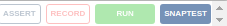

This is a doc that will explain how to launch and edit test using Snaptest, Nightwatch and Selenium.

[Snaptest](https://www.snaptest.io)  
[Nightwatch](http://nightwatchjs.org)  
[Selenium](http://www.seleniumhq.org)

Basically, Snaptest is a software that will help us creating test.  
1. It can catch the action made on a web page, save and export them using the Google Chrome extension 
2. It can run the test through a terminal, if you have the required software and test(obviously).

A. Catch an action, translate it to test, save and export them

First, you will need to add the Snaptest extension to chrome. Link to the extension: 
[Extension](https://chrome.google.com/webstore/detail/snaptest/aeofjocnhdlleichkjbaibdbicpcddhp)  
You will then need to login in the extension. (There is an admin account, usable by the Maintainer of the Leosac Web UI).  
Once you are logged, there is an interface with all the previously recorded test.

To record a test, this is very simple: 
1. Open the Snaptest extension when you are on the page that you want to test
2. Press the record button on the little toolbox that should have appeared : 
3. Just press stop once you have done your actions
4. There is now a test in the repository, you can use it like that, just press the play button to use it

To export a test, your account has an API key, save it for later.

B. Run the test through a terminal  

In order to use the previously generated test in a locally, on a terminal, you have the normally everything in hand,
just make sure that you have `snaptest-cli` installed globally (`[sudo] npm install -g snaptest-cli`)

To import the test, you need the API key (it will import all the test from the extension), then use this command:
`snaptest -f Hy3s0TGWf -r nightwatch -s flat -t <API key>`. Be careful, it will remove the _/snaptests_ folder to 
replace it with the new tests. 

You will then have all the tests in a folder named _snaptests_. To run this tests, use the command: `npm test`.

If you want to run the test on an other browser than Google chrome,
replace `google chrome` with `firefox` in the _nightwatch.json_ file here:
```
{
  "test_settings" : {
  * * *
     "desiredCapabilities": {
     "browserName": "<browser name>",
     * * *
     }
  },
}
```

For your information, Snaptest use Nightwatch as an End-to-End Webdriver 
(maybe we will use python or Java if this is supported in the future),
 who then use Selenium as a server to run the test locally.